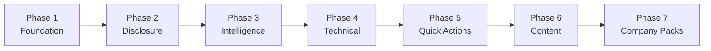

# StaffPath Surgical Improvement Plan

A phased, low-risk enhancement plan for StaffPath — a local-first Staff Software Engineer preparation app (React 19, TypeScript, Vite, Vitest).

**Status:** Phases 1–7 complete  
**Branch:** `cursor/phase1-foundation-enhancements-4675`  
**Pull request:** [#2](https://github.com/mkhalid-s/StaffPath/pull/2)  
**Last updated:** August 27, 2026

---

## Executive summary

StaffPath already had strong content breadth: 90-day roadmap, 21 encyclopedia chapters, 47 practice scenarios, mock interviews, and local-first persistence. The Surgical Improvement Plan focused on **guided onboarding**, **progressive disclosure**, **actionable intelligence**, **offline resilience**, and **deeper foundation content** — without breaking existing learner data or requiring a backend.

| Metric | Before | After |
|---|---|---|
| Preparation modes | Fixed 90-day plan | Intensive, Moderate, Casual, Custom |
| Onboarding | None | Welcome → mode → assessment → recommendations |
| Feature access | All features visible day one | Progressive unlock with celebrations |
| Dashboard intelligence | Static next session | What's-next engine, velocity, streaks, heatmap |
| Offline writes | Read cache only | Queued journal/practice/roadmap writes |
| Keyboard navigation | Mouse-only | ⌘K search, ⌘1–8 nav, ⌘N journal, ⌘? help |
| Quick actions | None | Context-aware FAB |
| Detailed foundation chapters | 6 full + 15 templates | 10 full + 11 templates |
| Company packs | None | 6 optional overlays |

**Verification:** 56/56 tests passing · TypeScript clean · CI green · 21-chapter content contract maintained

---

## Design principles

These constraints governed every phase:

1. **Local-first** — no account, no backend, no implicit data transfer
2. **Backward compatible** — legacy `staffpath-state` data migrates automatically
3. **Surgical scope** — enhance existing flows; avoid rewrites
4. **Evidence over volume** — reading alone does not demonstrate readiness
5. **Progressive complexity** — reveal features as learners earn them
6. **One-hour daily scope** — respect realistic preparation time

---

## Phase overview



---

## Phase 1 — Foundation enhancements

**Goal:** Meet learners where they are with flexible pacing and structured onboarding.

### Deliverables

| Feature | Description |
|---|---|
| Preparation modes | Intensive (90d/60min), Moderate (120d/45min), Casual (180d/30min), Custom |
| Onboarding flow | Welcome → mode selection → skill assessment → personalized recommendations |
| Profile extensions | `preparationMode`, `customMode`, onboarding flags |
| Session scaling | Daily session blocks scale to selected mode duration |
| Recommendations | Competency gaps mapped to encyclopedia chapters and practice scenarios |

### Key files

- `src/domain/preparationModes.ts`
- `src/domain/appState.ts`
- `src/features/onboarding/OnboardingGuide.tsx`
- `src/features/onboarding/SkillAssessment.tsx`
- `src/lib/recommendations.ts`
- `src/lib/sessionPlan.ts`

### Acceptance criteria

- [x] New users complete onboarding before accessing the main app
- [x] Mode selection adjusts session duration and roadmap pacing
- [x] Assessment produces chapter and practice recommendations
- [x] Existing profiles migrate without data loss

---

## Phase 2 — Progressive feature disclosure

**Goal:** Reduce overwhelm for new learners by unlocking features as they demonstrate engagement.

### Deliverables

| Feature | Description |
|---|---|
| Unlock criteria | Per-section requirements based on sessions, practice, and assessment |
| Locked navigation | Sidebar and routes guard locked features |
| Unlock celebrations | Modal when a new section becomes available |
| Dashboard progress | Shows next unlock and upcoming locked features |
| Settings override | "Unlock all" toggle for experienced users |

### Key files

- `src/lib/featureUnlocks.ts`
- `src/features/shell/AppShell.tsx`
- `src/features/shell/LockedFeaturePage.tsx`
- `src/features/shell/UnlockCelebration.tsx`
- `src/app/App.tsx`

### Unlock progression (default)

| Order | Feature | Typical unlock |
|---|---|---|
| 1 | Today, Roadmap | Immediate |
| 2 | Coach | 1 session |
| 3 | Curriculum | 3 sessions |
| 4 | Practice Lab | 5 sessions |
| 5 | Encyclopedia | 1 practice attempt |
| 6+ | Resources, Lifecycle, Interviews, Skills, Communication, Handbook, Journal | Progressive |

---

## Phase 3 — Intelligence and analytics

**Goal:** Turn activity data into actionable next steps and visible learning patterns.

### Deliverables

| Feature | Description |
|---|---|
| What's-next engine | Prioritized actions from sessions, mistakes, assessments, and streaks |
| Learning velocity | Sessions and focus time over rolling windows |
| Streak tracking | Consecutive active days |
| Milestones | Progress markers at 25%, 50%, 75%, 100% |
| Focus areas | Weakest assessed competencies surfaced for review |
| Analytics tab | Competency radar chart and activity heatmap on Skills page |
| Dashboard hero | Top intelligent action replaces static next-session copy |

### Key files

- `src/lib/intelligence.ts`
- `src/features/dashboard/IntelligentRecommendations.tsx`
- `src/features/assessment/AnalyticsPage.tsx`
- `src/features/assessment/CompetencyRadar.tsx`
- `src/features/assessment/TimeHeatmap.tsx`

---

## Phase 4 — Technical foundation

**Goal:** Strengthen offline resilience and power-user navigation.

### Deliverables

| Feature | Description |
|---|---|
| Enhanced service worker | Shell cache, content cache, stale-while-revalidate (v2) |
| Offline write queue | Journal, practice, and roadmap writes queued when offline |
| Connection status | Banner showing online/offline state and pending sync count |
| Keyboard shortcuts | ⌘K search, ⌘1–8 section nav, ⌘N journal, ⌘R roadmap, ⌘? help |
| Shortcut help modal | Discoverable shortcut reference |

### Key files

- `public/sw.js`
- `src/lib/offlineQueue.ts`
- `src/lib/keyboardShortcuts.ts`
- `src/components/ShortcutHelp.tsx`
- `src/components/ConnectionStatus.tsx`
- `src/lib/router.tsx` (`navigate()` helper)

### Shortcut reference

| Shortcut | Action |
|---|---|
| ⌘K | Focus search |
| ⌘1–8 | Navigate to section |
| ⌘N | Open journal |
| ⌘R | Open roadmap |
| ⌘? | Show shortcut help |

---

## Phase 5 — Quick Actions FAB

**Goal:** Surface the highest-value action from anywhere in the app.

### Deliverables

| Feature | Description |
|---|---|
| Context-aware actions | Start session, random practice, due mistakes, weakest competency |
| FAB component | Floating button with badge for pending items |
| Intelligence integration | Actions ranked by the what's-next engine |

### Key files

- `src/lib/quickActions.ts`
- `src/components/QuickActionsFab.tsx`
- `src/features/shell/AppShell.tsx`

---

## Phase 6 — Content completion and company packs

### Phase 6.1 — Detailed foundation chapters

**Goal:** Replace template seed content with Staff-level depth for the highest-impact topics.

| Chapter | ID | Coverage |
|---|---|---|
| Requirements and quality attributes | `requirements-quality-attributes` | Architecture drivers, non-goals, validation |
| CAP, PACELC, and consistency | `cap-pacelc-consistency` | Per-dataset models, session guarantees, partition behavior |
| Consensus and coordination | `consensus-coordination` | Raft, fencing tokens, control vs data plane |
| Distributed transactions | `distributed-transactions` | Sagas, outbox/inbox, compensation, reconciliation |
| Advanced caching patterns | `cache-stampede` | Multi-tier caches, invalidation, hot-key isolation |

**Key files:** `src/data/encyclopediaDetailedFoundations.ts`, `src/data/encyclopediaChapters.ts`

The 21-chapter content contract is preserved. Template `messaging-delivery-semantics` was replaced by `distributed-transactions`.

### Phase 6.2 — Company-specific packs (initial)

**Goal:** Optional interview context overlays without changing core content.

| Pack | Focus |
|---|---|
| Google | System design depth, distributed systems, estimation at scale |
| Meta | Product sense, cross-functional influence, execution |
| Netflix | Ownership, operational excellence, candid feedback |
| Startup | Pragmatism, speed, right-sized architecture |

**Key files:** `src/data/companyPacks.ts`, `src/features/settings/CompanyPackSelection.tsx`

Packs add chapter angle overlays and practice context cards in Encyclopedia and Practice Lab.

---

## Phase 7 — Extended company packs

**Goal:** Complete coverage of company packs referenced in the content architecture.

| Pack | Focus |
|---|---|
| Amazon | Leadership Principles, ownership, operational rigor, payment flows |
| Atlassian | Platform APIs, collaborative delivery, multi-tenancy |

**Key files:** `src/data/companyPacks.ts`, `README.md`

---

## Architecture map (post-plan)

```
src/
├── app/                    App shell, routing, error boundary
├── components/             ConnectionStatus, QuickActionsFab, ShortcutHelp
├── data/
│   ├── encyclopediaChapters.ts
│   ├── encyclopediaDetailedFoundations.ts   ← Phase 6.1
│   ├── encyclopediaFoundations.ts
│   └── companyPacks.ts                      ← Phases 6.2, 7
├── domain/
│   ├── appState.ts                          ← Profile extensions
│   └── preparationModes.ts                  ← Phase 1
├── features/
│   ├── onboarding/                          ← Phase 1
│   ├── dashboard/                           ← Phases 2, 3
│   ├── assessment/                          ← Phase 3 analytics
│   ├── settings/                            ← Phases 2, 6.2, 7
│   └── shell/                               ← Phases 2, 4, 5
└── lib/
    ├── featureUnlocks.ts                    ← Phase 2
    ├── intelligence.ts                      ← Phase 3
    ├── offlineQueue.ts                      ← Phase 4
    ├── keyboardShortcuts.ts                 ← Phase 4
    ├── quickActions.ts                      ← Phase 5
    └── recommendations.ts                   ← Phase 1
```

---

## Test and release checklist

```sh
npm ci
npm run check      # TypeScript
npm test           # 56 tests
npm run build      # Production bundle
npm audit          # Dependency security
```

| Area | Tests |
|---|---|
| Onboarding | `OnboardingGuide.test.tsx` |
| Feature unlocks | `featureUnlocks.test.ts` |
| Intelligence | `intelligence.test.ts` |
| Quick actions | `quickActions.test.ts` |
| Offline queue | `offlineQueue.test.ts` |
| Keyboard shortcuts | `keyboardShortcuts.test.ts` |
| Company packs | `companyPacks.test.ts` |
| Content contract | `contentContract.test.ts` (21 chapters) |

---

## Suggested backlog (post-merge)

These items were intentionally out of scope for the surgical plan:

| Priority | Item | Rationale |
|---|---|---|
| High | Expand remaining 11 template foundation chapters | Same depth as Phase 6.1 targets |
| Medium | Restore `messaging-delivery-semantics` as a full chapter | Replaced by distributed transactions; content still valuable |
| Medium | Walkthrough screenshots for onboarding and unlock flows | Demo evidence for reviewers |
| Low | Remote AI critique adapter | Requires explicit opt-in per product vision |
| Low | Cloud sync | Contradicts local-first principle unless optional export/sync adapter |

### Template chapters awaiting full content

- API and protocol selection
- Load balancing and rate limiting
- Database selection and sharding
- Retries, circuit breakers, and bulkheads
- SLOs, observability, and incidents
- Security and multi-tenancy
- Safe delivery and migrations
- Technical strategy, RFCs, and ADRs
- Production RAG
- Agents and tool calling
- Influence, conflict, and feedback

---

## How to share this plan

- **GitHub:** Link to this file on the PR or in a project wiki
- **Markdown export:** Copy `docs/SURGICAL_IMPROVEMENT_PLAN.md` directly
- **Stakeholder summary:** Share the Executive summary and Phase overview sections
- **Engineering handoff:** Share Architecture map, Key files per phase, and Test checklist

---

## Related documentation

- [Product vision](PRODUCT_VISION.md)
- [Content architecture](CONTENT_ARCHITECTURE.md)
- [Production readiness](PRODUCTION_READINESS.md)
- [Research sources](RESEARCH_SOURCES.md)
