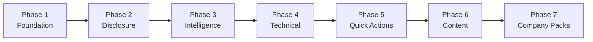

# StaffPath Surgical Improvement Plan

Complete reference for the phased enhancement of StaffPath — a local-first Staff Software Engineer preparation app (React 19, TypeScript, Vite, Vitest).

**Status:** Phases 1–7 complete  
**Merged:** [#2](https://github.com/mkhalid-s/StaffPath/pull/2) (implementation)  
**Documentation PR:** [#3](https://github.com/mkhalid-s/StaffPath/pull/3) (this document)  
**Last updated:** August 27, 2026

---

## Table of contents

1. [Executive summary](#executive-summary)
2. [Design principles](#design-principles)
3. [Phase overview](#phase-overview)
4. [Phase 1 — Foundation enhancements](#phase-1--foundation-enhancements)
5. [Phase 2 — Progressive feature disclosure](#phase-2--progressive-feature-disclosure)
6. [Phase 3 — Intelligence and analytics](#phase-3--intelligence-and-analytics)
7. [Phase 4 — Technical foundation](#phase-4--technical-foundation)
8. [Phase 5 — Quick Actions FAB](#phase-5--quick-actions-fab)
9. [Phase 6 — Content and company packs](#phase-6--content-and-company-packs)
10. [Phase 7 — Extended company packs](#phase-7--extended-company-packs)
11. [Application reference](#application-reference)
12. [Content inventory](#content-inventory)
13. [Architecture map](#architecture-map)
14. [Test and release checklist](#test-and-release-checklist)
15. [Post-merge backlog](#post-merge-backlog)
16. [How to share this plan](#how-to-share-this-plan)

---

## Executive summary

StaffPath already had strong content breadth: 90-day roadmap, 21 encyclopedia chapters, 47 practice scenarios, mock interviews, and local-first persistence. The Surgical Improvement Plan added **guided onboarding**, **progressive disclosure**, **actionable intelligence**, **offline resilience**, **deeper foundation content**, and **optional company interview overlays** — without breaking existing learner data or requiring a backend.

| Metric | Before | After |
|---|---|---|
| Preparation modes | Fixed 90-day plan | Intensive, Moderate, Casual, Custom |
| Onboarding | None | Welcome → mode → assessment → recommendations |
| Feature access | All features visible day one | Progressive unlock with celebrations |
| Dashboard intelligence | Static next session | What's-next engine, velocity, streaks, heatmap |
| Offline writes | Read cache only | Queued journal/practice/roadmap writes |
| Keyboard navigation | Mouse-only | ⌘K search, ⌘1–8 nav, ⌘N journal, ⌘R roadmap, ⌘? help |
| Quick actions | None | Context-aware FAB (up to 5 actions) |
| Detailed encyclopedia chapters | 6 full + 15 templates | 10 full + 11 templates |
| Company packs | None | 6 optional overlays (Google, Meta, Netflix, Startup, Amazon, Atlassian) |

**Verification:** 56/56 tests passing · TypeScript clean · CI green · 21-chapter content contract maintained

---

## Design principles

1. **Local-first** — no account, no backend, no implicit data transfer
2. **Backward compatible** — legacy `staffpath-state` data migrates automatically to `staffpath-v2`
3. **Surgical scope** — enhance existing flows; avoid rewrites
4. **Evidence over volume** — reading alone does not demonstrate readiness
5. **Progressive complexity** — reveal features as learners earn them
6. **One-hour daily scope** — respect realistic preparation time (scaled by mode)

---

## Phase overview



| Phase | Name | Status |
|---|---|---|
| 1 | Foundation enhancements | ✅ Complete |
| 2 | Progressive feature disclosure | ✅ Complete |
| 3 | Intelligence and analytics | ✅ Complete |
| 4 | Technical foundation | ✅ Complete |
| 5 | Quick Actions FAB | ✅ Complete |
| 6.1 | Detailed foundation chapters | ✅ Complete |
| 6.2 | Company packs (initial four) | ✅ Complete |
| 7 | Extended company packs | ✅ Complete |

---

## Phase 1 — Foundation enhancements

**Goal:** Meet learners where they are with flexible pacing and structured onboarding.

### Deliverables

| Feature | Description |
|---|---|
| Preparation modes | Intensive (90d/60min), Moderate (120d/45min), Casual (180d/30min), Custom |
| Onboarding flow | Welcome → mode selection → skill assessment → personalized recommendations |
| Profile extensions | `preparationMode`, `customMode`, `onboardingComplete`, `skillAssessmentComplete` |
| Session scaling | Daily session blocks scale to selected mode duration |
| Recommendations | Competency gaps mapped to encyclopedia chapters and practice scenarios |

### Preparation modes

| Mode | Days | Daily minutes | Focus seconds | Sessions/week |
|---|---|---|---|---|
| Intensive | 90 | 60 | 3600 | 7 |
| Moderate | 120 | 45 | 2700 | 5–6 |
| Casual | 180 | 30 | 1800 | 3–4 |
| Custom | 60–365 | 15–120 | computed | computed |

Custom mode clamps: `totalDays` 60–365, `dailyMinutes` 15–120.

### Onboarding steps

1. **Welcome** — name capture, product introduction
2. **Mode selection** — choose preparation pace
3. **Skill assessment** — self-rate 8 competencies (1–5) with optional evidence
4. **Recommendations** — personalized chapter and practice suggestions
5. **Complete** — sets `onboardingComplete` and `skillAssessmentComplete`

### Key files

- `src/domain/preparationModes.ts`
- `src/domain/appState.ts`
- `src/features/onboarding/OnboardingGuide.tsx`
- `src/features/onboarding/SkillAssessment.tsx`
- `src/lib/recommendations.ts`
- `src/features/roadmap/sessionPlan.ts`

### Acceptance criteria

- [x] New users complete onboarding before accessing the main app
- [x] Mode selection adjusts session duration and roadmap pacing
- [x] Assessment produces chapter and practice recommendations
- [x] Existing profiles migrate without data loss
- [x] `findWeakestCompetencies` only uses assessed scores (not unassessed defaults)

---

## Phase 2 — Progressive feature disclosure

**Goal:** Reduce overwhelm for new learners by unlocking features as they demonstrate engagement.

### Deliverables

| Feature | Description |
|---|---|
| Unlock criteria | Per-section requirements based on sessions, practice, and assessment |
| Locked navigation | Sidebar shows locked state; routes render `LockedFeaturePage` |
| Unlock celebrations | Modal when a new section becomes available (`celebratedUnlocks` tracking) |
| Dashboard progress | Shows next unlock and upcoming locked features |
| Settings override | `unlockAll` toggle for experienced users |

### Complete unlock requirements

| Feature | Path | Requirement |
|---|---|---|
| Today | `/` | Always available |
| Roadmap | `/roadmap` | Always available |
| Coach | `/coach` | Complete onboarding |
| Curriculum | `/curriculum` | 1 roadmap session |
| Practice Lab | `/practice` | 2 roadmap sessions |
| Encyclopedia | `/encyclopedia` | Complete onboarding |
| Resources | `/resources` | 5 roadmap sessions |
| Lifecycle | `/lifecycle` | Complete onboarding |
| Interview Studio | `/interviews` | 7 roadmap sessions |
| Skills | `/skills` | Complete skill assessment |
| Communication | `/communication` | 3 roadmap sessions |
| Handbook | `/handbook` | 1 practice attempt |
| Journal | `/journal` | 2 roadmap sessions |
| Data & backup | `/settings` | Always available |

`unlockAll: true` bypasses all gates. `celebratedUnlocks` prevents repeat celebration modals.

### Key files

- `src/lib/featureUnlocks.ts`
- `src/app/AppShell.tsx`
- `src/components/LockedFeaturePage.tsx`
- `src/components/UnlockCelebration.tsx`
- `src/app/App.tsx`

### Acceptance criteria

- [x] Locked routes show requirement and progress
- [x] Navigation reflects locked/unlocked state
- [x] New unlocks trigger celebration modal once
- [x] Settings "unlock all" immediately grants access
- [x] Dashboard shows next unlock with progress bar

---

## Phase 3 — Intelligence and analytics

**Goal:** Turn activity data into actionable next steps and visible learning patterns.

### Deliverables

| Feature | Description |
|---|---|
| What's-next engine | Prioritized actions from sessions, mistakes, assessments, and streaks |
| Learning velocity | `accelerating` / `steady` / `plateau` / `inactive` based on weekly sessions |
| Streak tracking | Consecutive days with session or journal activity |
| Milestones | Progress markers at 25%, 50%, 75%, 100% of roadmap |
| Focus areas | Weakest assessed competencies with practice/mistake context |
| Activity heatmap | 12-week daily activity grid (sessions, practice, journal) |
| Competency radar | Eight-area self-assessment visualization |
| Dashboard hero | Top intelligent action replaces static next-session copy |
| Intelligent recommendations | Ranked action cards on dashboard |

### Intelligence engine API (`src/lib/intelligence.ts`)

| Function | Returns |
|---|---|
| `computeStreak(state)` | Consecutive active days |
| `analyzeLearningPatterns(state)` | Streak, weekly sessions, velocity, time by category, schedule suggestion |
| `identifyFocusAreas(state, limit)` | Weakest competencies with reasons |
| `buildWhatsNextActions(state)` | Prioritized `IntelligentAction[]` (mistakes, roadmap, practice, chapters, communication, journal) |
| `computeMilestones(state)` | Roadmap completion milestones |
| `buildActivityHeatmap(state, weeks)` | Daily activity counts for heatmap |

### Action priority order (typical)

1. Due mistakes (priority 100)
2. Next roadmap session (85)
3. Practice for weakest competency (70–)
4. Incomplete chapter for gap area
5. Communication rep
6. Journal reflection

### Key files

- `src/lib/intelligence.ts`
- `src/features/dashboard/IntelligentRecommendations.tsx`
- `src/features/dashboard/DashboardPage.tsx`
- `src/features/analytics/AnalyticsPage.tsx`
- `src/components/charts/CompetencyRadar.tsx`
- `src/components/charts/TimeHeatmap.tsx`
- `src/features/assessment/AssessmentPage.tsx` (Analytics tab)

### Acceptance criteria

- [x] Dashboard hero shows top intelligent action
- [x] Recommendations update based on mistakes, gaps, and progress
- [x] Analytics tab renders radar and heatmap
- [x] Streak counts sessions and journal entries
- [x] Velocity compares this week vs last week

---

## Phase 4 — Technical foundation

**Goal:** Strengthen offline resilience and power-user navigation.

### Deliverables

| Feature | Description |
|---|---|
| Enhanced service worker | Shell cache, content cache, stale-while-revalidate (`public/sw.js` v2) |
| Offline write queue | Journal, practice, and roadmap writes queued in `staffpath-offline-queue` |
| Background sync | Service worker registration for queue flush on reconnect |
| Connection status | Banner showing online/offline and pending sync count |
| Keyboard shortcuts | Global shortcuts with typing-target guard |
| Shortcut help modal | Discoverable reference (⌘?) |
| Shortcut toast | Brief feedback on navigation shortcuts |
| Programmatic navigation | `navigate()` helper in router |

### Keyboard shortcuts

| Shortcut | Action | Target |
|---|---|---|
| ⌘K | Focus encyclopedia search | `/encyclopedia` |
| ⌘1 | Today | `/` |
| ⌘2 | Coach | `/coach` |
| ⌘3 | Roadmap | `/roadmap` |
| ⌘4 | Curriculum | `/curriculum` |
| ⌘5 | Practice Lab | `/practice` |
| ⌘6 | Encyclopedia | `/encyclopedia` |
| ⌘7 | Resources | `/resources` |
| ⌘8 | Lifecycle | `/lifecycle` |
| ⌘N | New journal entry | `/journal` |
| ⌘R | Roadmap session | `/roadmap` |
| ⌘? | Show shortcut help | modal |

Uses `metaKey` or `ctrlKey`. Disabled when focus is in input/textarea unless modifier held.

### Offline queue

| Queued type | Trigger |
|---|---|
| `journal` | Journal save while offline |
| `practice` | Practice attempt while offline |
| `roadmap` | Session completion while offline |

Queue stored in `localStorage` key `staffpath-offline-queue`. `ConnectionStatus` shows pending count. `initOfflineSync()` listens for `online` event.

### Key files

- `public/sw.js`
- `src/lib/offlineQueue.ts`
- `src/lib/keyboardShortcuts.ts`
- `src/components/ShortcutHelp.tsx`
- `src/components/ShortcutToast.tsx`
- `src/components/ConnectionStatus.tsx`
- `src/lib/router.tsx`

### Acceptance criteria

- [x] Service worker caches shell and static assets
- [x] Offline writes enqueue without data loss
- [x] Connection banner reflects online/offline state
- [x] All shortcuts navigate correctly
- [x] Shortcut help modal lists all bindings

---

## Phase 5 — Quick Actions FAB

**Goal:** Surface the highest-value action from anywhere in the app.

### Deliverables

| Feature | Description |
|---|---|
| Context-aware actions | Up to 5 ranked actions based on state and unlocks |
| FAB component | Floating button bottom-right with mistake badge |
| Random practice | Picks random track and scenario index |
| Intelligence integration | Merges engine actions with fixed high-priority items |

### Quick action priority (typical)

| Priority | Action | Condition |
|---|---|---|
| 100 | Review due mistakes | Mistakes due today, interviews unlocked |
| 90 | Start today's session | Next roadmap day available |
| 70 | Practice random scenario | Practice unlocked |
| 65 | Quick journal entry | Journal unlocked |
| 55 | Communication rep | Communication unlocked |
| varies | Intelligence actions | Top 2 from `buildWhatsNextActions` |

### Key files

- `src/lib/quickActions.ts`
- `src/components/QuickActionsFab.tsx`
- `src/app/AppShell.tsx`

### Acceptance criteria

- [x] FAB visible on all main routes
- [x] Badge shows due mistake count
- [x] Random practice updates `practiceCursor`
- [x] Actions respect feature unlocks
- [x] Maximum 5 actions displayed

---

## Phase 6 — Content and company packs

### Phase 6.1 — Detailed foundation chapters

**Goal:** Replace template seed content with Staff-level depth for the highest-impact topics.

| Chapter | ID | Status | Coverage |
|---|---|---|---|
| Requirements and quality attributes | `requirements-quality-attributes` | **Full** | Architecture drivers, non-goals, validation |
| CAP, PACELC, and consistency | `cap-pacelc-consistency` | **Full** | Per-dataset models, session guarantees, partition behavior |
| Consensus and coordination | `consensus-coordination` | **Full** | Raft, fencing tokens, control vs data plane |
| Distributed transactions | `distributed-transactions` | **Full** | Sagas, outbox/inbox, compensation, reconciliation |
| Advanced caching patterns | `cache-stampede` | **Full** | Multi-tier caches, invalidation, hot-key isolation |

**Key files:** `src/data/encyclopediaDetailedFoundations.ts`, `src/data/encyclopediaChapters.ts`

The 21-chapter content contract is preserved. Template `messaging-delivery-semantics` was replaced by `distributed-transactions`.

### Phase 6.2 — Company-specific packs (initial)

| Pack | ID | Focus areas |
|---|---|---|
| Google | `google` | System design, distributed systems, capacity estimation |
| Meta | `meta` | Product thinking, cross-functional influence, execution |
| Netflix | `netflix` | Ownership, operational excellence, candid feedback |
| Startup | `startup` | Pragmatism, speed, right-sized architecture |

**Key files:** `src/data/companyPacks.ts`, `src/features/settings/CompanyPackSelection.tsx`

Packs add chapter angle overlays in Encyclopedia and practice context cards in Practice Lab. Selected via Settings → Company Pack.

### Acceptance criteria (Phase 6)

- [x] Five foundation topics have full chapter schema (16 sections each)
- [x] Content contract test passes (21 chapters)
- [x] Company pack selection persists in profile
- [x] Chapter angles render in Encyclopedia when pack active
- [x] Practice context renders when pack active

---

## Phase 7 — Extended company packs

**Goal:** Complete coverage of company packs referenced in the content architecture.

| Pack | ID | Focus areas |
|---|---|---|
| Amazon | `amazon` | Leadership Principles, ownership, operational rigor, payment flows |
| Atlassian | `atlassian` | Platform APIs, collaborative delivery, multi-tenancy |

### Acceptance criteria

- [x] Amazon and Atlassian packs added to `COMPANY_PACKS`
- [x] `CompanyPackId` type extended
- [x] Tests cover all six packs
- [x] README documents all packs

---

## Application reference

### Routes

| Path | Page | Lazy loaded |
|---|---|---|
| `/` | Dashboard (Today) | No |
| `/coach` | Preparation coach | Yes |
| `/roadmap` | 90-day executor | Yes |
| `/curriculum` | Curriculum map | Yes |
| `/practice` | Practice Lab | Yes |
| `/encyclopedia` | Engineering encyclopedia | Yes |
| `/resources` | Resource library | Yes |
| `/lifecycle` | Preparation lifecycle | Yes |
| `/interviews` | Interview Studio | Yes |
| `/skills` | Skills assessment + analytics | Yes |
| `/communication` | Communication Gym | Yes |
| `/handbook` | Evidence handbook | Yes |
| `/journal` | Learning journal | Yes |
| `/settings` | Data & backup | Yes |

### Profile schema (`UserProfile`)

| Field | Type | Description |
|---|---|---|
| `name` | string | Display name |
| `startDate` | string | ISO date preparation started |
| `onboardingComplete` | boolean | Finished onboarding flow |
| `preparationMode` | `PreparationMode` | intensive / moderate / casual / custom |
| `customMode` | `CustomModeConfig?` | Custom days and minutes |
| `skillAssessmentComplete` | boolean | Finished competency self-assessment |
| `unlockAll` | boolean | Bypass progressive disclosure |
| `celebratedUnlocks` | string[] | Feature IDs already celebrated |
| `selectedCompanyPack` | `CompanyPackId` | Active company overlay |

### Competencies (skill assessment)

| ID | Title |
|---|---|
| `technical-foundations` | Technical foundations |
| `system-design` | System design |
| `production` | Production engineering |
| `business` | Business and product |
| `execution` | Cross-team execution |
| `influence` | Influence and strategy |
| `communication` | Communication |
| `mentoring` | Mentoring and leverage |

### State persistence

| Key | Storage | Contents |
|---|---|---|
| `staffpath-v2` | localStorage | Full `StaffPathState` (version 2) |
| `staffpath-offline-queue` | localStorage | Pending offline writes |
| Service worker caches | Cache API | Shell and static assets |

---

## Content inventory

### Encyclopedia chapters (21 total)

#### Full-detail chapters (10)

| ID | Title | Category | Source |
|---|---|---|---|
| `capacity-estimation` | Capacity estimation | Systems | `encyclopediaChapters.ts` |
| `cache-stampede` | Advanced caching patterns | Reliability | `encyclopediaChapters.ts` |
| `idempotent-webhooks` | Idempotent payment webhooks | Data | `encyclopediaChapters.ts` |
| `virtual-waiting-room` | Virtual waiting room | Architecture | `encyclopediaChapters.ts` |
| `semantic-cache` | Semantic cache for LLM applications | AI | `encyclopediaChapters.ts` |
| `llm-router` | LLM model router | AI | `encyclopediaChapters.ts` |
| `requirements-quality-attributes` | Requirements and quality attributes | Architecture | `encyclopediaDetailedFoundations.ts` |
| `cap-pacelc-consistency` | CAP, PACELC, and consistency | Systems | `encyclopediaDetailedFoundations.ts` |
| `consensus-coordination` | Consensus and distributed coordination | Systems | `encyclopediaDetailedFoundations.ts` |
| `distributed-transactions` | Distributed transactions | Data | `encyclopediaDetailedFoundations.ts` |

#### Template chapters (11) — expandable via `expand()` in `encyclopediaFoundations.ts`

| ID | Title | Category |
|---|---|---|
| `api-protocol-selection` | API and protocol selection | Systems |
| `load-balancing-rate-limits` | Load balancing and rate limiting | Reliability |
| `database-selection-sharding` | Database selection and sharding | Data |
| `resilience-patterns` | Retries, circuit breakers, and bulkheads | Reliability |
| `slo-observability-incidents` | SLOs, observability, and incidents | Reliability |
| `security-multitenancy` | Security and multi-tenancy | Architecture |
| `safe-delivery-migrations` | Safe delivery and migrations | Architecture |
| `technical-strategy-decisions` | Technical strategy, RFCs, and ADRs | Leadership |
| `production-rag` | Production RAG | AI |
| `agents-tool-calling` | Agents and tool calling | AI |
| `influence-conflict-feedback` | Influence, conflict, and feedback | Leadership |

#### Removed chapter

| ID | Replaced by |
|---|---|
| `messaging-delivery-semantics` | `distributed-transactions` (content overlap; restore as separate chapter in backlog) |

### Company packs (6)

#### Google (`google`)

**Focus:** System design, Distributed systems, Capacity estimation

| Chapter angle | Topic |
|---|---|
| `capacity-estimation` | Back-of-envelope math with uncertainty ranges |
| `cap-pacelc-consistency` | Spanner-style consistency trade-offs |
| `consensus-coordination` | Chubby, Borg, Colossus references |
| `load-balancing-rate-limits` | Global load balancing, hot tenants |

**Behavioral:** Reliability at scale; latency vs consistency decisions

---

#### Meta (`meta`)

**Focus:** Product thinking, Cross-functional influence, Execution

| Chapter angle | Topic |
|---|---|
| `requirements-quality-attributes` | Quality attributes tied to product metrics |
| `influence-conflict-feedback` | Influencing PM and design partners |
| `technical-strategy-decisions` | Cross-team alignment with incomplete info |

**Behavioral:** Product direction through technical insight; quality vs speed

---

#### Netflix (`netflix`)

**Focus:** Culture fit, Judgment, Operational ownership

| Chapter angle | Topic |
|---|---|
| `slo-observability-incidents` | End-to-end service ownership |
| `resilience-patterns` | Chaos engineering expectations |
| `influence-conflict-feedback` | Candid feedback culture |

**Behavioral:** Judgment without permission; difficult feedback

---

#### Startup (`startup`)

**Focus:** Pragmatism, Speed, Breadth

| Chapter angle | Topic |
|---|---|
| `safe-delivery-migrations` | Reversible decisions, incremental delivery |
| `technical-strategy-decisions` | Pragmatic architecture with limited headcount |
| `capacity-estimation` | Right-size for 10x, not 1000x |

**Behavioral:** Shipping imperfect to learn; deciding what not to build

---

#### Amazon (`amazon`)

**Focus:** Leadership Principles, Ownership, Operational excellence

| Chapter angle | Topic |
|---|---|
| `distributed-transactions` | Ownership and Dive Deep on financial outcomes |
| `idempotent-webhooks` | Payment flows, durable receipts |
| `slo-observability-incidents` | Customer Obsession, error budgets |
| `influence-conflict-feedback` | Earn Trust, Disagree and Commit |
| `technical-strategy-decisions` | Think Big, one-way vs two-way doors |

**Behavioral:** Ownership beyond scope; Dive Deep; disagree and commit

---

#### Atlassian (`atlassian`)

**Focus:** Collaboration, Platform APIs, Sustainable delivery

| Chapter angle | Topic |
|---|---|
| `api-protocol-selection` | Stable public APIs, versioning, DX |
| `safe-delivery-migrations` | Incremental shipping without breaking consumers |
| `technical-strategy-decisions` | Cross-team alignment with clear owners |
| `security-multitenancy` | Tenant isolation and blast radius |
| `influence-conflict-feedback` | Play as a Team, trust across functions |

**Behavioral:** Multi-team alignment; developer experience; speed vs platform quality

---

### Other content contracts

| Content | Count | Source |
|---|---|---|
| Roadmap sessions | 90 | `src/data/roadmap.ts` |
| Curriculum modules | 12 | `src/data/curriculum.ts` |
| Practice scenarios | 47 | `src/data/practiceCatalog.ts` |
| Communication lessons | 14 | `src/data/communicationLessons.ts` |
| Learning resources | 16 | `src/data/resources.ts` |
| Interview prompts | ≥6 per format | `src/data/interviewPrompts.ts` |

### Practice tracks

| Track | Competency mapping | Scenarios |
|---|---|---|
| `design` | system-design | System design cases |
| `problem` | technical-foundations | Diagnostic / production cases |
| `people` | influence | Leadership and behavioral |
| `sdlc` | execution | Delivery and SDLC scenarios |

---

## Architecture map

```
src/
├── app/
│   ├── App.tsx                 Routing, shortcuts, offline sync, onboarding shell
│   ├── AppShell.tsx            Navigation, FAB, connection status
│   └── RouteErrorBoundary.tsx
├── components/
│   ├── ConnectionStatus.tsx    Phase 4
│   ├── QuickActionsFab.tsx     Phase 5
│   ├── ShortcutHelp.tsx        Phase 4
│   ├── ShortcutToast.tsx       Phase 4
│   ├── UnlockCelebration.tsx   Phase 2
│   ├── LockedFeaturePage.tsx   Phase 2
│   └── charts/
│       ├── CompetencyRadar.tsx Phase 3
│       └── TimeHeatmap.tsx     Phase 3
├── data/
│   ├── encyclopediaChapters.ts
│   ├── encyclopediaDetailedFoundations.ts   Phase 6.1
│   ├── encyclopediaFoundations.ts
│   └── companyPacks.ts                      Phases 6.2, 7
├── domain/
│   ├── appState.ts                          Profile extensions
│   ├── preparationModes.ts                  Phase 1
│   └── encyclopedia.ts                      Chapter schema
├── features/
│   ├── onboarding/                          Phase 1
│   ├── dashboard/                           Phases 2, 3
│   ├── analytics/                           Phase 3
│   ├── assessment/                          Skills + analytics tab
│   ├── settings/                            Phases 2, 6, 7
│   ├── encyclopedia/                        Chapter detail + pack angles
│   ├── practice/                            Pack context cards
│   └── …                                    (coach, roadmap, journal, etc.)
└── lib/
    ├── featureUnlocks.ts                    Phase 2
    ├── intelligence.ts                      Phase 3
    ├── offlineQueue.ts                      Phase 4
    ├── keyboardShortcuts.ts                 Phase 4
    ├── quickActions.ts                      Phase 5
    ├── recommendations.ts                   Phase 1
    ├── appStore.ts                          State + migration
    └── router.tsx                           Client router + navigate()
```

---

## Test and release checklist

```sh
npm ci
npm run check      # TypeScript
npm test           # 56 tests
npm run build      # Production bundle
npm audit          # Dependency security
```

| Area | Test file |
|---|---|
| Onboarding | `OnboardingGuide.test.tsx` |
| Feature unlocks | `featureUnlocks.test.ts` |
| Intelligence | `intelligence.test.ts` |
| Quick actions | `quickActions.test.ts` |
| Offline queue | `offlineQueue.test.ts` |
| Keyboard shortcuts | `keyboardShortcuts.test.ts` |
| Company packs | `companyPacks.test.ts` |
| Recommendations | `recommendations.test.ts` |
| Preparation modes | `preparationModes.test.ts` |
| Content contract | `contentContract.test.ts` |
| Page interactions | Roadmap, Practice, Encyclopedia, Assessment, etc. |

---

## Post-merge backlog

| Priority | Item | Rationale |
|---|---|---|
| High | Expand 11 template foundation chapters to full detail | Same depth as Phase 6.1 |
| Medium | Restore `messaging-delivery-semantics` as dedicated chapter | Valuable content removed during 6.1 |
| Medium | Walkthrough screenshots for onboarding and unlock flows | Demo evidence |
| Low | Remote AI critique adapter | Requires explicit opt-in per product vision |
| Low | Cloud sync | Optional adapter only; contradicts local-first default |

---

## How to share this plan

| Audience | Sections to share |
|---|---|
| **Stakeholders** | Executive summary, Phase overview, Content inventory |
| **Engineering** | All phases with acceptance criteria, Architecture map, Test checklist |
| **Content reviewers** | Phase 6, Encyclopedia chapters, Company packs |
| **Interview prep users** | Preparation modes, Company packs, Competencies |

**Formats:**
- GitHub: link to `docs/SURGICAL_IMPROVEMENT_PLAN.md`
- Markdown: copy file directly
- PDF: export from GitHub or any markdown renderer

---

## Related documentation

- [Product vision](PRODUCT_VISION.md)
- [Content architecture](CONTENT_ARCHITECTURE.md)
- [Production readiness](PRODUCTION_READINESS.md)
- [Research sources](RESEARCH_SOURCES.md)
